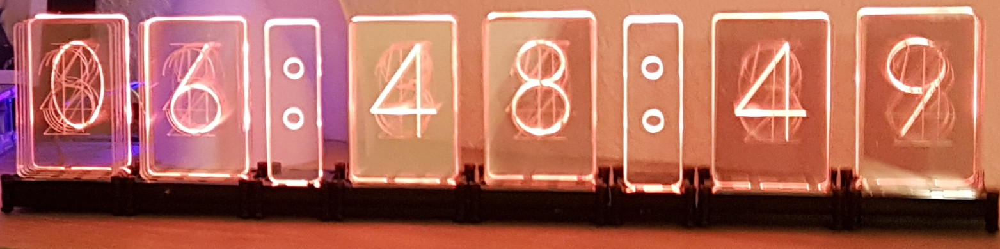
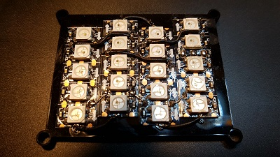
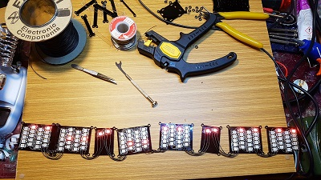
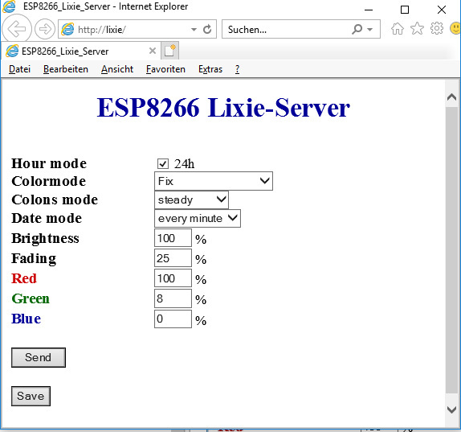

# Lixie-Uhr mit ESP8266

Eine Uhr mit lasergeschnittenen Komponenten (außer LED, Kabel, Schrauben und Controller) basierend auf einem [ESP8266 NodeMCU](https://www.aliexpress.com/item/1PCS-ESP8266-NodeMCU-V3-Lua-WIFI-module-memory-32M-Flash-USB-serial-CH340G/32820380705.html) mit adressierbaren RGB-LED-Stripes
Die 3D-Modelle für das Gehäuse sind auf thingiverse.com [Uhren-Teile](http://www.thingiverse.com/thing:3392585) und [ESP8266-Gehäuse](https://www.thingiverse.com/thing:3392585) verfügbar.

Die Software ist noch in Entwicklung und soll z.B. noch um die Zeitzoneneingabe erweitert werden.

## Hardware Setup

Für den Aufbau der Word-Clock werden folgende Komponenten benötigt:

- [ESP8266 NodeMCU](https://www.aliexpress.com/item/1PCS-ESP8266-NodeMCU-V3-Lua-WIFI-module-memory-32M-Flash-USB-serial-CH340G/32820380705.html)
- [WS2812B RGB LED Strip 144/m IP30 black](https://www.aliexpress.com/item/DC5V-WS2812B-30-60-144-leds-m-Smartled-pixel-RGB-individually-addressable-led-strip-light-Black/32849686500.html): Die Gehäuseteile sind für die Verwendung dieser LED ausgelegt. Bei bestimmten LED-Typen benötigt man einen Pegelwandler von den 3,3V des ESP8266 auf die 5V der LED. 
- optional [ESP8266-Gehäuse](https://www.thingiverse.com/thing:2842012)
- 1 USB-Netzteil
- diverse Kabel, Lötwerkzeug
- die [lasergeschnittenen Teile](http://www.thingiverse.com/thing:3392585)

# Hardwareaufbau:

Die Verbindung vom ESP8266 zum LED-Stripe kann wie [hier](https://github.com/lvidarte/esp8266/wiki/MicroPython:-NeoPixels) beschrieben erfolgen. Wie abgebildet, kann auch "D5" (Pin 14) als Datenpin verwendet werden. Über die Änderung der Definition für "DATA_PIN" in Zeile 42 der "ino"-Datei kann dieser Pin auf Wunsch auch geändert werden.

Die Spannungsversorgung kann über den USB-Port erfolgen.  

Die Taste für die kurzzeitige Anzeige des Datums liegt aktuell auf GPIO0. Damit kann die Flash-Taste des ESP8266 für diesen Zweck benutzt werden. Durch Neudefinition von "DATE_BUTTON" kann auch jeder beliebige andere Port verwendet werden. 

# Software

Das Projekt besteht nur aus einer einzigen "ino"-Datei, welche nach Einbindung der erforderlichen Bibliotheken mit jeder Arduino-tauglichen Entwicklungsumgebung gebaut und geflasht werden kann.

##### Standard-Bibliotheken
* DNSServer
* Wire
* SPI
* EEPROM
##### Spezial-Bibliotheken
* aus [ESP8266-core](https://github.com/esp8266/Arduino)
	* ESP8266
	* ESP8266WebServer
	* ESP8266WiFi
* [NTPClient](https://github.com/arduino-libraries/NTPClient)
* [WiFiManager](https://github.com/tzapu/WiFiManager)
* [Time](https://github.com/PaulStoffregen/Time)
* [Timezone](https://github.com/JChristensen/Timezone)
* [FastLED](https://github.com/FastLED/FastLED)
* [NeoPixel](https://github.com/adafruit/Adafruit_NeoPixel)
* [Ticker](https://github.com/esp8266/Arduino/tree/master/libraries/Ticker)
* [OneButton](https://github.com/mathertel/OneButton)

Um die korrekte Ortszeit aus den NTP-Daten berechnen zu können, müssen die sogenannten "DST-rules" in den Zeilen 79 und 81 im Quellfile entsprechend der Bibliotheksbeschreibung [Timezone](https://github.com/JChristensen/Timezone) angepaßt werden. 

## Web-Interface

Damit auf den ESP8266 zugegriffen werden kann, muß sich dieser im WLAN anmelden können. Das erledigt der WiFi-Manager, dessen Konfiguration auf [dessen Seite](https://github.com/tzapu/WiFiManager#how-it-works) beschrieben ist.

Die Steuerung der Uhr über Webinterface funktioniert von jedem beliebigen Gerät mit Web-Client (Browser, wget, curl o.Ä.) aus. Hier eine Beschreibung der Befehle und Parameter für das Webinterface (statt "clockip" die IP des des ESP8266 (auslesbar am Router oder über die serielle Konsole) und statt "color" die gewünschten Farben "RED", "GREEN" oder "BLUE" verwenden. "n" wird durch die gewünschten Ziffern ersetzt. "on" schaltet eine Option ein, "off" schaltet sie aus.
Wird hinter dem "=" kein Parameter angegeben, wird statt der aktualisierten Website der Wert des entsprechenden Parameters als Plaintext mit Zeilenumbruch am Ende zurückgegeben. Also "http://clockip/?BRIGHT=" liefert z.B. "BRIGHT=100". Diese Antwort kann dann mit Scripten ausgwertet werden, über welche auch eine Steuerung der Uhr erfolgen kann.

*24h-Modus setzen:*  
`http://clockip?HMOD24=on`

Mit "on" wird die 24h-Anzeige aktiviert, mit "off" arbeitet die Uhr im 12h-Modus.

*Farb-Modus setzen:*  
`http://clockip?MODE=n`

Mit "n" wird der Farbmodus ausgewählt. "n" kann dabei Werte von 0 bis 3 annehmen:
	
- 0: alle Ziffern werden mit dem mit "RED", "GREEN" und "BLUE" eigestellten Farbton angezeigt 
- 1: alle Ziffern werden in einer Farbe angezeigt, welche das gesamte Farbspektrum durchläuft
- 2: ausgehend von der erste Ziffer ändert sich die Farbe dem Spektrum folgend bis zur letzten Ziffer
- 3: wie Modus 2 nur wird das Spektrum kontinuierlich durch alle Ziffern geschoben

*Anzeigeart der Doppelpunkte einstellen:*  
`http://clockip?CMODE=n`

Mit "n" wird das Verhalten der Doppelpunkte eingestellt. "n" kann dabei Werte von 0 bis 4 annehmen:
	
- 0: die Doppelpunkte sind aus
- 1: die Doppelpunkte leuchten ständig
- 2: die Doppelpunkte blinken im Sekundenrythmus
- 3: im Sekundenrythmus wechseln sich oberer und unterer Punkt der Doppelpunkte ab
- 4: vormittags blinken die unteren, nachmittags die oberen Punkte im Sekundenrythmus

*Anzeigeart des Datums einstellen:*  
`http://clockip?DMODE=n`

Mit "n" wird das Verhalten der Datumsanzeige eingestellt. "n" kann dabei Werte von 0 bis 4 annehmen:
	
- 0: kein Datum anzeigen
- 1: am Anfang jeder Minute das Datum für 4 Sekunden anzeigen 
- 2: am Anfang jeder Stunde das Datum für 4 Sekunden anzeigen
- 3: das Datum jetzt für 4 Sekunden anzeigen (ändert den aktuellen Modus nicht dauerhaft)

*Gesamthelligkeit setzen (0...100%):*  
`http://clockip?BRIGHT=nnn`

*Überblendzeit der Ziffern steuern:*  
`http://clockip?FADE=nn`

Mit "nn" wird die Überblendzeit beim Ziffernwechsel in 10-Millisekunden-Schritte  eingestellt. "nn" kann Werte von 1 bis 80 annehmen. Mit 1 springt die Anzeige von einer Ziffer zur nächsten, mit 80 benötigt sie 800 ms, also fast eine ganze Anzeigeperiode. Empfohlen wird ein Wert von maximal 30.

*Intensität einer Farbe setzen (0...100%):*  
`http://clockip?color=nnn`

Nicht vergessen: statt "color" die Farben "RED", "GREEN" oder "BLUE" einsetzen.

*Einstellungen speichern*  
`http://clockip?SAVE=`

Die vorher getätigten Einstellungen werden im EEPROM abgespeichert und beim nächsten Einschalten wieder verwendet.

Da ein Web-Server ingtegriert ist, kann die Einstellung der Parameter auch einfach über einen Browser erfolgen. Die Einstellungsseite sieht dann so aus:

Die zu sehenden Parameter entsprechen den weiter oben erläuterten. Die getätigten Einstellungen werden erst mit dem Button "Senden" gesammelt an die Uhr übertragen, und mit "Speichern" dort auch für den nächsten Start gespeichert.